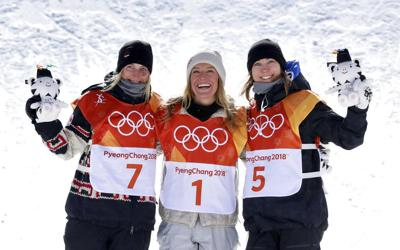

## Top-100 performers of the 5-th session of [mlcourse.ai](http://mlcourse.ai) by OpenDataScience, spring 2019

According to the [final rating](https://drive.google.com/open?id=1LAy1eK8vIONzIWgcCEaVmhKPSj579zK5lrECf_tQT60). The session took place from February 6 till April 26, 2019, there were about 1600 participants.

1. Vladimir Sapachev, [GitHub](https://github.com/N0rdream), [email](mailto:vsapachev@gmail.com)
1. Tarasov Sergey, [GitHub](https://github.com/RiSearcher), [LinkedIn](https://www.linkedin.com/in/sergej-tarasov-8b7716131/), [email](mailto:tarasov@pmi.lv)
1. Vlad Kisin, [GitHub](https://github.com/vladkisin), [email](mailto:vladkisin1996@gmail.com), [LinkedIn](https://www.linkedin.com/in/vladislav-kisin-6a5785173/)
1. Andrei Konshin, [GitHub](https://github.com/akenshin), [email](andreikonshin@gmail.com), [LinkedIn](https://www.linkedin.com/in/andrei-konshin-313304b0/)
1. Wayde Herman, [GitHub](https://github.com/WaydeHerman), [LinkedIn](https://www.linkedin.com/in/wayde-herman-10986685/), [email](mailto:wayde.h@gmail.com)
1. Korepanov Alexey,  [GitHub](https://github.com/grazder),  [LinkedIn](http://linkedin.com/in/grazder), [email](mailto:grazder@yandex.ru)
1. Meynardo Jose
1. Ustinov Dmitry, [GitHub](https://github.com/dm1tryx),  [LinkedIn](https://www.linkedin.com/in/dmitry-ustinov/),  [email](mailto:ust.dmit@gmail.com)
1. Nikita Rubinkovskiy, [GitHub](http://github.com/Fissium/), [LinkedIn](https://www.linkedin.com/in/rubinkovskiy/), [email](mailto:NARubinkovskiy@gmail.com)
1. Andreas Kouzelis, [GitHub](http://github.com/kuzand/), [LinkedIn](https://www.linkedin.com/in/kuzand/), [email](mailto:kuzand@hotmail.com)
1. Vadim Shestopalov, [LinkedIn](https://www.linkedin.com/in/vadim-shestopalov/), [email](mailto:vdmshestopalov@gmail.com)
1. Shokhan Birlikov, [LinkedIn](https://www.linkedin.com/in/birlikov/) , [email](mailto:birlikoff@gmail.com)
1. Mikhail Tribunskiy, [GitHub](https://github.com/MiTribunskiy/), [LinkedIn](https://www.linkedin.com/in/tribunskiy/), [email](mailto:mitribunskiy@gmail.com)
1. Ivan Zaikin, [GitHub](https://github.com/utapyngo/), [email](mailto:ut@pyngo.tom.ru)
1. Alexey Serov, [GitHub](https://github.com/AlexS90), [email](mailto:ayiserov@gmail.com)
1. Thomas Chambon, [GitHub](https://github.com/tchambon), [LinkedIn](https://www.linkedin.com/in/thomas-chambon-0a648664/)
1. Dmitry Vladimirov, [GitHub](https://github.com/Dmitry513), [LinkedIn](https://www.linkedin.com/in/dmitry-vladimirov-9a704913b/),  [email](mailto:vladimirov.dm513@yandex.ru)
1. Gennady Laptev
1. Vladimir Kozlov, [email](mailto:kozlowladimir@gmail.com)
1. Mikhail Efimov, [LinkedIn](https://www.linkedin.com/in/mikhail-efimov/), [email](mikhail.m.efimov@gmail.com)
1. Alexander Lyubich, [LinkedIn](https://www.linkedin.com/in/alexander-lyubich-8b6215174/), [email](mailto:avlyubich@gmail.com)
1. Roman Volykhin, [GitHub](https://github.com/GerrBert), [email](roman.volykhin@gmail.com)
1. Maxim Golovatchev, [email](maximgolovatchev@gmail.com), [LinkedIn](https://www.linkedin.com/in/maxim-golovatchev-94229912a/)
1. Mikhail Slivin,  [GitHub](https://github.com/spknnk/), [LinkedIn](https://www.linkedin.com/in/spknnk/) , [email](mailto:spknnk@gmail.com)
1. Alexander Vasin, [GitHub](https://github.com/vad4msiu), [LinkedIn](https://www.linkedin.com/in/vad4msiu/), [email](mailto:vad4msiu@gmail.com)
1. Sergei Samsonov
1. Shivam Panwar, [GitHub](https://github.com/shivampanwar), [LinkedIn](https://www.linkedin.com/in/shivam-panwar-284989101/), [email](mailto:panwar.shivam199@gmail.com) 
1. Petr Kungurtsev, [GitHub](https://github.com/Corwinpro), [email](mailto:corwinat@gmail.com) [website](http://petrkungurtsev.me) 
1. Alexey Smirnov, [LinkedIn](https://www.linkedin.com/in/alexey-smirnov-611b621/), [email](mailto:alexey.i.smirnoff@gmail.com)
1. Dmitry Gluzdov, [GitHub](https://github.com/DIVIGL1), [LinkedIn](https://www.linkedin.com/in/dmitry-gluzdov-766b8b185/), [email](mailto:dmitry@gluzdov.ru)
1. Peter Fournier
1. Dmitry Tsarev, [LinkedIn](https://www.linkedin.com/in/dmitry-tsarev88/), [email](tsarspb@gmail.com)
1. Shravan Kumar Koninti, [GitHub](https://github.com/shravankoninti), [LinkedIn](https://www.linkedin.com/in/shravankoninti/), [email](mailto:shravankumar224@gmail.com)
1. Dmitry Burdeiny, [email](mailto:dmitry.burdeiny@gmail.com)
1. Pavel Gusev, [email](mailto:pavelgsv@gmail.com)
1. Alena Arykina
1. Evgeniy Chukanov
1. Aptha K S, [Github](https://github.com/apthagowda97), [LinkedIn](https://www.linkedin.com/in/apthaks/), [email](mailto:iamuraptha@gmail.com)
1. Rajasekhar Battula, [GitHub](https://github.com/rjs417), [LinkedIn](https://www.linkedin.com/in/rajasekhar-battula-99673b49/), [email](mailto:rajasekhar.battula@yahoo.in)
1. Rohit Gupta, [GitHub](https://github.com/rohitgr7/), [LinkedIn](https://www.linkedin.com/in/rohitgr7/), [email](mailto:rohitgr1998@gmail.com), [website](https://rohitgr7.github.io/)
1. Alexey Zapolskii , [GitHub](https://github.com/AlexZapolskii/), [LinkedIn](https://www.linkedin.com/in/алексей-запольский-90a259162/), [email](mailto:th1rt3n@yandex.ru)
1. Veronika Shilova, [GitHub](https://github.com/VeronikaShilova), [email](mailto:shilova_veronika@inbox.ru)
1. Armand Kulsh, [GitHub](https://github.com/Gogen120), [email](mailto:zenars85@mail.ru), [LinkedIn](https://www.linkedin.com/in/armand-kulsh-765901184/),
1. Anton Pekarskii, [email](mailto:deep_wizard@yahoo.com), [LinkedIn](https://www.linkedin.com/in/antonpekarskii/)
1. Mihail Parushkin, [email](mailto:mihail.parushkin@yandex.ru)
1. Artem Tregubenko, [GitHub](https://github.com/artitre), [email](mailto:tregubenkoart@gmail.com)
1. Oleg Chugalinsky, [email](mailto:chugalinsky@mail.ru)
1. Sergei Tsurkan
1. Gleb Krapivin, [LinkedIn](https://www.linkedin.com/in/gleb-krapivin-aa6812114/), [email](mailto:gleb.krapivin@gmail.com)
1. Uladzimir Zbanok, [email](mailto:uzbanok@gmail.com)
1. Vladimir Bolotin, [LinkedIn](https://www.linkedin.com/in/vladimir-bolotin-45360a1a/), [email](mailto:momun@mail.ru)
1. Hakan Ozler, [GitHub](https://github.com/ozlerhakan), [LinkedIn](https://www.linkedin.com/in/ozlerhakan/), [email](mailto:ozler.hakan@gmail.com)
1. Nikolay Kudinov, [GitHub](https://github.com/nkudinov), [email](mailto:oracle_developer@mail.ru), [LinkedIn](https://www.linkedin.com/in/nikolay-kudinov-9aaa697/)
1. Andrei Lomov, [email](mailto:muhortova58@gmail.com)
1. Anton Zavyalov
1. Alexandr Drozhzhin, [GitHub](https://github.com/jastfake), [LinkedIn](https://www.linkedin.com/in/alexandr-drozhzhin-916482103), [email](mailto:drozhzhinalex@gmail.com)
1. Vyacheslav Koloskov, [email](mailto:slivka_83@mail.ru)
1. Kirill Stroganov, [email](mailto:kiraplenkin@gmail.com), [GitHub](https://github.com/kiraplenkin)
1. Nick Bienko, [GitHub](https://github.com/bikolya/), [LinkedIn](https://www.linkedin.com/in/bikolya/)
1. Mikhail Yuldashev
1. Olya Yakushewa, [LinkedIn](https://www.linkedin.cn/in/olga-yakushewa-018006186)
1. Sita Krishnakumar, [GitHub](http://github.com/sitask/), [LinkedIn](https://www.linkedin.com/in/sitask/), [email](mailto:sita.krishnakumar@gmail.com)
1. Andres Tiko, [LinkedIn](https://www.linkedin.com/in/tiko)
1. Artem Ryblov
1. Viktor Nikolaev, [email](mailto:viktor_andreevich@outlook.com), [LinkedIn](www.linkedin.com/in/ViktorAndreevich)
1. Alexander Bunyatov
1. Maxim Yurchenko, [GitHub](https://github.com/mv-yurchenko/), [PersonalSite](https://mv-yurchenko.github.io), [email](maxonus2@gmail.com)
1. Irina Telina
1. Pavel Peskov, [GitHub](http://github.com/pchlq/), [twitter](https://www.twitter.com/Pchlq/), [email](mailto:peskovps@gmail.com), [LinkedIn](https://www.linkedin.com/in/pavel-peskov-8673a76/)
1. Alexander Chernyshov, [GitHub](https://github.com/alexbolduin), [email](mailto:achernys123@gmail.com)
1. Bruyako Maksim
1. Chavalapalli Varun
1. Pavel Nikalayeu, [LinkedIn](https://www.linkedin.com/in/pavelnikalayeu/), [email](mailto:pavel.nikalayeu@zoho.com)
1. Andrey Goldin
1. Aman Berry
1. Vladislav Golubtsov
1. Siarhei Kulaha
1. Aleksei Barykin, [LinkedIn](http://www.linkedin.com/in/aleksei-barykin-a5b76797),    [email](mailto:aleksei.bary@gmail.com)
1. Kostiantyn Shysh
1. Aleksey Morozov, [GitHub](https://github.com/am0r0z0v), [LinkedIn](https://www.linkedin.com/in/ao-morozov/), [email](mailto:a_m0r0z0v@mail.ru)
1. Ana-Maria Hristian, [LinkedIn](www.linkedin.com/in/ana-hristian), [email](mailto:parr.ana.maria@gmail.com), [GitHub](https://github.com/AnaHristian)
1. Dmitrii Vasilev, [GitHub](https://github.com/dmitriykel/), [CV](https://resume.io/r/kOvC2rs9O), [email](mailto:dmitriykehl@gmail.com), [Telegram](https://t.me/dmitriykel)
1. Vasily Suvorov, [emal](mailto:avalanche.v@gmail.com), [facebook](https://www.facebook.com/vasiliy.suvorov)
1. Volodymyr Bakhur, [LinkedIn](https://www.linkedin.com/in/vbakhur/), [email](mailto:volodyabakhur@gmail.com)
1. Ramis Imilbaev, [LinkedIn](www.linkedin.com/in/imilbaev), [email](mailto:fordsmail@ya.ru)
1. Denis Finogenov, [GitHub](github.com/denisfin), [email](denis.finogenov.ml@gmail.com)
1. Bohdan Dolishnii, [GitHub](https://github.com/SENSBoD), [LinkedIn](https://www.linkedin.com/in/bohdan-dolishnii/), [email](dolishniibohdan@gmail.com)
1. Ekaterina Krivtsova
1. Dmitry Saponov, [Github](https://github.com/DSaponov), [Linkedin](https://www.linkedin.com/in/dmitry-saponov-b5a42450/ ), [email](dsaponov1@yandex.ru )
1. Olga Braginskaya
1. Igor Babikov, [GitHub](https://github.com/sharkzeeh) [LinkedIn](https://www.linkedin.com/in/igor-babikov-031b7b150/), [email](mailto:igorbabikov24@gmail.com)
1. Aleynikov Sergey, [GitHub](https://github.com/AleynikovSergey), [email](aleynikov.sergey.a@gmail.com)
1. Matthias Seghers
1. Borislav Breusenko, [email](mailto:bbreusenko@gmail.com), [Linkedin](https://www.linkedin.com/in/borislav-breusenko-85727a146/ )
1. Mikhail Sheleh, [Github](https://github.com/lordofprograms), [Linkedin](https://www.linkedin.com/in/msheleh/), [email](mailto:shelegmike@gmail.com)
1. Anthony Sazonov, [GitHub](https://github.com/Jericho-kd), [email](mailto:ant-sazon@yandex.ru)
1. Omar Idres Gurashi, [LinkedIn](https://www.linkedin.com/in/omar-idres-gurashi-5b45a9144/), [email](mailto:omargurashi1@gmail.com)
1. Henry Yang, [LinkedIn](https://www.linkedin.com/in/yile-yang/), [email](mailto:yyl.henry@gmail.com)
1. Maxim Seregin, [email](mailto:horanzon@gmail.com)
1. Alexander Tretyak

## Top-100 performers of the 4-th session of [mlcourse.ai](http://mlcourse.ai) by OpenDataScience, fall 2018

According to the [final rating](https://goo.gl/vMHdED). The session took place from October 14 till December 21, 2018, there were about 2200 participants.

1. Maxim Klyuchnikov, [LinkedIn](https://www.linkedin.com/in/maxnk/), [email](mailto:maxim.n.klyuchnikov@gmail.com)
1. Ilya Larchenko, [LinkedIn](https://www.linkedin.com/in/larchenko/), [email](mailto:ilya.larchenko@gmail.com)
1. Ivan Pisarev, [GitHub](https://github.com/Pisarev-I), [LinkedIn](https://www.linkedin.com/in/pisarevi), [email](mailto:pisarev.ik@gmail.com)
1. Alexey Bykov, [GitHub](https://github.com/devcrab/), [LinkedIn](https://www.linkedin.com/in/alexey-bykov-mipt/), [email](mailto:alexey.bykov.mipt@gmail.com)
1. Kseniia Terekhova, [LinkedIn](https://www.linkedin.com/in/kseniia-terekhova-41b371b8/), [GitHub](https://github.com/prickly-u), [email](mailto:kterehova@gmail.com)
1. Alexander Kovalev, [GitHub](https://github.com/sankovalev/), [LinkedIn](https://www.linkedin.com/in/velavok/), [email](mailto:sankovalev@gmail.com)
1. Andrew Trefilov, [GitHub](http://github.com/lalka1/), [LinkedIn](https://www.linkedin.com/in/andtre/), [email](mailto:trefik92@gmail.com)
1. Nikolai Timonin, [GitHub](https://github.com/timoninn/), [LinkedIn](https://www.linkedin.com/in/timoninn/), [email](mailto:nikki.timonin@yandex.ru)
1. Alexander Nichiporenko, [GitHub](https://github.com/alexnich), [LinkedIn](https://www.linkedin.com/in/alexnich), [email](mailto:avnichiporenko@gmail.com)
1. Tatiana Nekrasova, [GitHub](https://github.com/polosataya/), [LinkedIn](https://www.linkedin.com/in/tnekrasova/), [email](mailto:gntv1977@gmail.com)
1. Kyriacos Kyriacou, [GitHub](https://github.com/kompiuter), [LinkedIn](https://www.linkedin.com/in/kyriacos-kyriacou-761806107)
1. Georgy Lazarev, [GitHub](https://github.com/justramgerry), [email](mailto:lazarev.georgy@yandex.ru)
1. Denis Mironov, [GitHub](https://github.com/dmironov1993), [LinkedIn](https://www.linkedin.com/in/denismironov/), [email](mailto:mironovdenis1993@gmail.com)
1. Valentin Kovalev, [GitHub](https://github.com/ValentinKovalev), [LinkedIn](https://www.linkedin.com/in/valentinkovalev/), [email](mailto:kovalev1580@gmail.com)
1. Ivan Kalininskii, [email](kiavip@gmail.com)
1. Irina Knyazeva, [email](iknyazeva@gmail.com), [ResearchGate](https://www.researchgate.net/profile/Irina_Knyazeva3 )
1. Alexander Veramyev, [GitHub](https://github.com/rrobolit), [LinkedIn](https://www.linkedin.com/in/veramyev/), [email](rrobolit@gmail.com) 
1. Neeraj Agrawal, [GitHub](https://github.com/MagnIeeT/), [LinkedIn](https://www.linkedin.com/in/neeraj-agrawal/), [email](mailto:neeraj13788@gmail.com)
1. Tatyana Kudasova, [email](mailto:kuzznetsova.t@gmail.com)
1. Syrovatskiy Ilya, [GitHub](https://github.com/Mercurialll/), [email](mailto:ilyasyr14@gmail.com)
1. Artem Kuznetsov, [GitHub](https://github.com/tyomikadze), [LinkedIn](https://www.linkedin.com/in/artem-kuznetsov-te/), [email](mailto:agkuznetsov@gmail.com)
1. Anton Gilmanov, [LinkedIn](https://www.linkedin.com/in/anton-gilmanov/), [email](mailto:anthonygil@yandex.ru) 
1. Georgy Surin, [email](mailto:suringeorgy94@gmail.com)
1. Barinov Konstantin, [LinkedIn](https://www.linkedin.com/in/konstantin-barinov/), [email](mailto:barinov.work-box@yandex.ru)
1. Dmitry Girdyuk, [GitHub](https://github.com/dmgirdyuk), [LinkedIn](https://www.linkedin.com/in/dmgirdyuk/), [email](dm.girdyuk@mail.ru) 
1. Korgun Dmitry, [GitHub](https://github.com/tbb), [email](mailto:dmitry.tbb@ya.ru)
1. Perepechin Danila, [GitHub](https://github.com/d-perepechin), [LinkedIn](https://www.linkedin.com/in/danila-perepechin/), [email](d.a.perepechin@gmail.com) 
1. Sergey Shkarin, [email](mailto:kouki.sergey@gmail.com), [LinkedIn](https://www.linkedin.com/in/kouki91/), [GitHub](https://github.com/SergeyShk)
1. Pavel Taiga, [GitHub](https://github.com/ptaiga), [LinkedIn](https://www.linkedin.com/in/ptaiga/), [email](mailto:paveltaiga@mail.ru)
1. Sergey Ustyantsev, [GitHub](https://github.com/schokoro), [LinkedIn](https://www.linkedin.com/in/schokoro/), [email](mailto:ustyantsev@gmail.com)
1. Alexander Laskorunskiy [LinkedIn](https://www.linkedin.com/in/alexander-laskorunskiy/), [email](mailto:umachkaalex@gmail.com)
1. Mikhail Deulin, [email](mailto:mikhaildeulin@gmail.com)
1. Ekaterina Skriptsova, [GitHub](https://github.com/actuallyykatie), [email](mailto:actuallyykatie@gmail.com)
1. Michael Afanasev
1. Nikita Simonov, [GitHub](https://github.com/geoc0ld),[email](mailto:simonoff.n.a@yandex.ru)
1. Samokhvalov Mikhail, [email](mailto:2051sam@gmail.com)
1. Sergey Bronskiy, [email](mailto:s.s.bronskiy@gmail.com)
1. Victor Tolmachev, [GitHub](https://github.com/greav), [LinkedIn](http://www.linkedin.com/in/victor-tolmachev-2406), [email](tolmachev.2406@gmail.com) 
1. Maxim Kashirin, [GitHub](https://github.com/MaximKsh), [LinkedIn](https://www.linkedin.com/in/kshmax), [email](mailto:ksh.max@gmail.com)
1. Mikhail Lunev, [GitHub](https://github.com/lunevm), [LinkedIn](http://www.linkedin.com/in/lunevm), [email](mailto:lunev.m78@gmail.com)
1. Gennadiy Mikhaylov, [email](mailto:genanady@gmail.com)
1. Aleksandr Seliverstov, [GitHub](https://github.com/seliverstov/), [email](mailto:seliverstov.a@gmail.com)
1. Alexander Nikolin, [GitHub](https://github.com/Howuhh), [LinkedIn](http://www.linkedin.com/in/howuhh), [email](mailto:hsehowuhh@gmail.com)
1. Joris Fournel, [GitHub](http://github.com/Jorisfournel/),  [LinkedIn](https://www.linkedin.com/in/jorisfournel/), [email](mailto:jorisfournell@gmail.com)
21. Alexander Otrokov [GitHub](https://github.com/oav711), [LinkedIn](https://www.linkedin.com/in/otrokov/), [email](mailto:oav711@gmail.com)
1. Alexey Bachurin
1. Elvira Diaminova, [GitHub](https://github.com/eelvira), [LinkedIn](https://www.linkedin.com/in/elvira-diaminova/), [email](mailto:e.diaminova@yandex.ru)
1. Odzhaev Rakhmet, [GitHub](https://github.com/odzhaev), [LinkedIn](https://www.linkedin.com/in/rodzhaev/), [email](mailto:rodzhaev@gmail.com)
1. Aleksei Demin, [GitHub](https://github.com/aleksei-dmn), [LinkedIn](https://www.linkedin.com/in/aleksei-demin/), [email](mailto:dmn.aleksei@gmail.com)
1. Pavel Humeniuk,  [LinkedIn](https://www.linkedin.com/in/pavel-humeniuk ), [email](mailto:phuman911@gmail.com)
1. Ermilov Vitaliy
1. Julia Mochalova, [GitHub](https://github.com/JuliaMochalova/ ), [LinkedIn](https://www.linkedin.com/in/juliamochalova/ ), [email](mailto:juliarychkova1@gmail.com)
1. Kirill Simakov, [email](mailto:kirill.simakov@gmail.com),  [LinkedIn](https://www.linkedin.com/in/kirill-simakov/), [GitHub](https://github.com/k-simakov)
1. Kozlov Sergey, [GitHub](https://github.com/kozlovsv), [LinkedIn](https://www.linkedin.com/in/kozlovsv/), [email](mailto:kozlovsv78@gmail.com)
1. Luis Herrera, [GitHub](https://github.com/luhego/), [LinkedIn](https://www.linkedin.com/in/luis-herrera-27263149/), [email](mailto:luhegoes@gmail.com)
1. Yuri Maigur, [GitHub](http://github.com/yurimaigur/), [LinkedIn](https://www.linkedin.com/in/yurimaigur/), [email](mailto:yuri.maigur@gmail.com)
1. Andre Barbosa, [LinkedIn](https://www.linkedin.com/in/barbosaandre/), [email](mailto:abarbosa0494@gmail.com)
1. Timur Sinyavsky, [GitHub](https://github.com/SinyTim/), [LinkedIn](https://www.linkedin.com/in/sinytim/), [email](mailto:sinytim@mail.ru)
1. Mikhail Korshchikov, [GitHub](https://github.com/mikhailsergeevi4), [LinkedIn](https://www.linkedin.com/in/mike-korschikov-63604a14a/), [email](mailto:mikhailsergeevi4@yandex.ru)
1. Sergey Parshukov, [LinkedIn](https://www.linkedin.com/in/sparshukov/), [email](mailto:sparshukov85@gmail.com)
1. Vadim Voskresenskii, [GitHub](https://github.com/voskresenskiy/), [LinkedIn](https://www.linkedin.com/in/vadim-voskresenskiy-9405b9a8/), [email](mailto:vadimvoskresenskiy@gmail.com)
1. Alexander Timofeev, [GitHub](https://github.com/artesby), [LinkedIn](https://www.linkedin.com/in/alexander-timofeev-/), [email](mailto:artesby1@gmail.com)
1. Andrew Mottes
1. Dmitry Labazkin, [email](mailto:lab_dmitriy@mail.ru)
1. Oleg Chekan, [LinkedIn](http://linkedin.com/in/oleg-chekan), [email](mailto:o.chekan@gmail.com) 
1. Andrey Viktorov, [LinkedIn](http://www.linkedin.com/in/viktorov-aa), [email](viktorov-aa@mail.ru)
1. Kozlov Maxim, [GitHub](https://github.com/komaksim), [email](mailto:komaksim@gmail.com)
1. Vladimir Varfolomeev, [email](mailto:v.e.varfolomeev@gmail.com)
1. Sergey Golubev
1. Alim Gubzhokov, [GitHub](http://github.com/spectr747/), [LinkedIn](https://www.linkedin.com/in/alim-gubzhokov-071118177/), [email](mailto:spectr747@gmail.com)
1. Wit Thanawitchayakarn, [GitHub](http://github.com/witwitchayakarn/), [LinkedIn](https://www.linkedin.com/in/wit-thanawitchayakarn-5ab27184/), [email](mailto:witwitchayakarn@gmail.com)
1. Bill Guo
1. Sergei Bulaev, [GitHub](https://github.com/ser-serege/BigDataBig), [LinkedIn](https://www.linkedin.com/in/sergei-bulaev), [email](mailto:s.a.bulaev@yandex.ru)
1. Kirill Panin, [GitHub](https://github.com/KirillPanin), [LinkedIn](https://www.linkedin.com/in/kirill-panin/), [email](mailto:kirylpanin@gmail.com)
1. Pavel Platonov, [email](mailto:scientist74@gmail.com)
1. Anton Petrov, [GitHub](http://github.com/gsenseless), [LinkedIn](https://www.linkedin.com/in/anton-p-693b4875/), [email](mailto:gjobspam+mlcai@gmail.com)
1. Daria Skakun, [email](mailto:theskada@gmail.com)
1. Anna Kashcheeva, [LinkedIn](https://www.linkedin.com/in/anna-kashcheeva-0a004715b/), [email](mailto:l.oompa@yandex.ru)
1. Aleksei Ashikhmin, [GitHub](https://github.com/apokrif333 ), [email](mailto:alex.ah@list.ru )
1. Ekaterina Chebeneva, [email](mailto:ekaterina.chebeneva@mail.ru)
1. Roman Danilov, [GitHub](https://github.com/danilovrju/), [LinkedIn](https://www.linkedin.com/in/danilovrju/), [email](mailto:danilovrju@yandex.ru)
1. Igor Sorokin, [LinkedIn](https://www.linkedin.com/in/igor-sorokin-405bb5121/)
1. Aleksey Smirnov, [LinkedIn](https://www.linkedin.com/in/aleksey-smirnov-aa3898177/), [email](mailto:alexsmir@list.ru)
1. Natalia Domozhirova, [LinkedIn](https://www.linkedin.com/in/natalia-domozhirova-81bb8b2/), [email](mailto:dnn37@mail.ru)
1. Nikolai Pliev, [email](mailto:nickpliev@gmail.com)
1. Gleb Levitskiy, [GitHub](https://github.com/GLevV), [LinkedIn](https://www.linkedin.com/in/gleb-levitskiy-0a9122177/), [email](mailto:gp.ultimum@gmail.com)
1. Alexey Vinogradov, [LinkedIn](https://www.linkedin.com/in/aleksey-vinogradov-02846625/), [email](mailto:tenchi1988@gmail.com)
1. Andrei Rem, [GitHub](http://github.com/andreirem), [LinkedIn](https://www.linkedin.com/in/andrei-rem), [email](mailto:andrei.rem.ds@gmail.com)
1. Svetlana Sudarkova, [GitHub](https://github.com/sudarkova), [LinkedIn](https://www.linkedin.com/in/sudarkova), [email](mailto:sudarkova.sveta@gmail.com)
1. Aleksandr Korotkov, [LinkedIn](https://www.linkedin.com/in/alexandr-korotkov/), [email](mailto:krotix@gmail.com)
1. Haowen Jiang, [GitHub](https://github.com/Jianghaowen/), [LinkedIn](https://www.linkedin.com/in/jiang-haowen-618970158/), [email](mailto:j534878350@gmail.com)
1. Ackerley Tng, [GitHub](https://github.com/ackerleytng/), [LinkedIn](https://www.linkedin.com/in/ackerleytng/), [email](mailto:ackerleytng@gmail.com)
1. Aleksandr Kuptsov, [GitHub](https://github.com/Kommunarus), [LinkedIn](http://www.linkedin.com/in/Kuptsov-Aleksandr), [email](kooptsov@gmail.com)
1. Andreas Louka, [GitHub](https://github.com/AndreasLouka), [LinkedIn](https://www.linkedin.com/in/andreas-louka-2a2095131/), [email](andreas.louca19@gmail.com) 
1. Aleksandr Okhilkov, [LinkedIn](http://www.linkedin.com/in/aokhilkov), [email](mailto:oxil91l3v@gmail.com)
1. Sergey Rukhmanov, [GitHub](https://github.com/giiuser/), [LinkedIn](https://www.linkedin.com/in/giuser/), [email](mailto:grandemeist@gmail.com)
1. Stanislav Kravchuk
1. Moss Ebeling, [LinkedIn](https://www.linkedin.com/in/mossimo-ebeling) [email](mailto:mossbanay+mlcourse@gmail.com)
1. Andrey Varkentin, [email](mailto:andrei.varkentin@yandex.ru)
1. Bin Jia, [LinkedIn](https://www.linkedin.com/in/bin-jia-79986720/), [email](mailto:flyerae@gmail.com)

*Older ratings can be found in the course repo [Wiki](https://github.com/Yorko/mlcourse.ai/wiki).*
